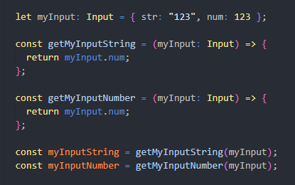

# BTG Pactual Dark Theme 🎨✨

Welcome to the BTG Pactual Dark Theme! This theme brings the sleek and sophisticated color palette of BTG Pactual to your favorite code editor. Get ready to code in style with a touch of financial elegance. 📈💻

## Installation Guide

1. **Open VS Code**: Fire up your Visual Studio Code.
2. **Go to Extensions**: Hit `Ctrl+Shift+X` (Windows/Linux) or `Cmd+Shift+X` (Mac) to open the Extensions sidebar.
3. **Search for BTG Pactual Dark Theme**: Type "BTG Pactual Dark Theme" in the search bar.
4. **Install the Theme**: Click the `Install` button to add the theme to your VS Code.
5. **Activate the Theme**: After installation, click the `Set Color Theme` button, or go to the Command Palette (`Ctrl+Shift+P` or `Cmd+Shift+P`), type `Preferences: Color Theme`, and select `BTG Pactual`.

## Features

- **Elegant Blue Tones**: Feel the calm and clarity with BTG's signature blue hues.
- **Professional Grays**: Experience the balance with subtle and refined shades of gray.
- **Accent Colors**: Boost your coding experience with strategic pops of BTG's accent colors.

## Screenshots

_Your code has never looked this good!_

## Color Reference

- **Primary Blue**: #5C88DA - The core color that represents trust and intelligence.
- **Secondary Blue**: #B8CCEA - Slightly lighter, adding depth and variety.
- **Accent Yellow**: #F8E08E - Perfect for highlights and important elements.
- **Neutral Gray**: #D6E1F5 - Keeps things grounded and professional.
- **Background Gray**: #BFBFBF - A clean and simple background that’s easy on the eyes.

## Contributing

Got some ideas to make this theme even better? We'd love your contributions!

1. **Fork the Repository**: Click the `Fork` button on GitHub.
2. **Create a New Branch**: Use `git checkout -b feature/your-feature-name`.
3. **Make Your Changes**: Customize the theme to your heart's content.
4. **Submit a Pull Request**: Share your enhancements with the community.

## Feedback

We’d love to hear your thoughts! Drop us a review or open an issue on our (TODO) [GitHub repository](https://github.com/yourusername/btg-pactual-vscode-theme).

## Special Thanks

A huge thank you to the BTG Pactual design team for their inspiring color palettes and to all the developers who use and contribute to this theme. You make coding a beautiful experience! 🌟

## License

This theme is licensed under the [MIT License](LICENSE.md).

---

Happy Coding! 💙💛🖥️

_Jean Outeiral_

---

_Note: BTG Pactual is a financial institution. This theme is not officially affiliated with or endorsed by BTG Pactual._
